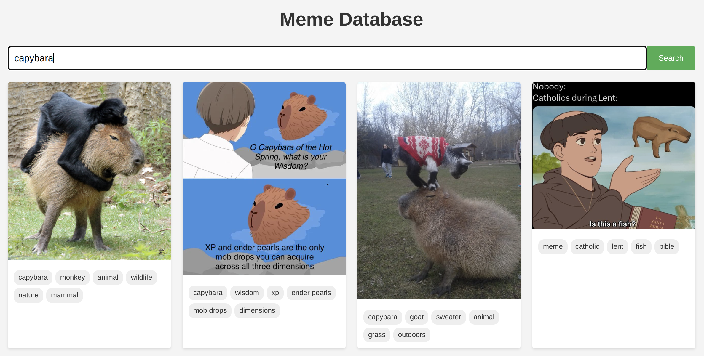

# Meme Database (a "vibe-coding" experiment)

> **WARNING: This is an experiment with AI-written code.** Much of this code has never been looked at by a human.

A single-user database for storing, indexing and searching meme images. All meme categorization is handled automatically using a visual LLM through Ollama.

The original working version of this program was written by [Claude Code](https://docs.anthropic.com/en/docs/agents-and-tools/claude-code/overview), with no human-written parts. Some help was provided by a human, including the spec, some general advice, and debugging help. See [CLAUDE.md](./CLAUDE.md) for Claude's notes.



## Human-written code

Other human-written bits added to make this more useful:

- Improved LLM prompt using "structured output" mode and JSON schema. This fixed OCR text extraction with gemma3:27b, which is still somewhat picky.
- Semantic search didn't include any human written code. But it was still a true collaborative effort between AI and human to actually figure out how to make it work. Neither the AI nor the human would have made it on their own this time, largely thanks to massive breakage in many parts of the ecosystem.

## Features

- Import memes from a local directory
- Automatic meme categorization with AI
- Text extraction from meme images
- Keyword generation and categorization 
- Search memes by text, description, or keywords using SQLite FTS5
- Web UI for browsing and searching memes
- Duplicate detection using SHA256 hash

## Requirements

- Node.js (v18+)
- npm
- Ollama (v0.6.0+) with the gemma3:27b model installed

## Getting Started

1. Clone this repository
2. Install dependencies

```bash
npm install
```

3. Configure the environment variables (optional)

```
PORT - Server port (default: 3001)
DB_PATH - Path to SQLite database (default: './memedb/memes.sqlite3')
MEME_DIR - Directory for storing meme files (default: './memedb/memes')
OLLAMA_HOST - Ollama API host (default: 'http://localhost:11434')
AI_MODEL - AI model to use (default: 'gemma3:27b')
```

4. Start Ollama server with your preferred model

```bash
ollama serve
```

5. Import memes from a directory

```bash
npm run import /path/to/meme/folder
```

6. Start the web UI

```bash
npm run serve
```

7. Open http://localhost:3001 in your browser

## Project Structure

- `memedb/` - Database and meme files
  - `memes.sqlite3` - SQLite database containing metadata
  - `memes/$CATEGORY/$FILENAME.$EXT` - Organized meme images
- `src/` - Source code
  - `index.ts` - Main entry point and Express server
  - `client/` - React frontend
    - `src/` - Client source code
      - `App.tsx` - Main React application component
      - `components/` - React UI components
      - `hooks/` - React custom hooks
      - `types/` - TypeScript type definitions
  - `scripts/` - Import and database management scripts
  - `services/` - Database and AI services
  - `models/` - Data models
  - `migrations/` - Database migration files
  - `utils/` - Utility functions

## Commands

- `npm run dev` - Start the backend development server
- `npm run dev:client` - Start the React frontend development server
- `npm run dev:all` - Run both backend and frontend in development mode
- `npm run serve` - Build and serve production web UI
- `npm run import <path>` - Import memes from a directory
- `npm run migrate` - Run database migrations
- `npm run clear-db` - Clear database (use with caution)
- `npm run build` - Build the project (server and client)
- `npm run lint` - Run ESLint
- `npm test` - Run all tests
- `npm run test:server` - Run server-side tests
- `npm run test:client` - Run client-side tests
- `npm run check` - Run linting, tests, and build (recommended before committing)

## Search Capabilities

The meme database supports full-text search using SQLite's FTS5 extension. Search is performed across meme text, descriptions, keywords, and filenames.

### Sample Queries

- Simple word search: `cat`
- Multiple words (implicit AND): `cat dog` (finds memes with both words)
- Exact phrase: `"surprised pikachu"` (words must appear in this order)
- OR operator: `cat OR dog` (finds memes with either term)
- AND operator: `cat AND dog` (same as implicit AND)
- NOT operator: `cat NOT dog` (finds memes with "cat" but not "dog")
- Grouping: `pikachu AND (surprised OR detective)`
- Proximity search: `NEAR(cat dog, 5)` (terms must be within 5 words of each other)
- Prefix search: `meme*` (matches "meme", "memes", "memetic", etc.)
- Field-specific search: `text:pikachu keywords:pokemon`

### Search Tips

- Searches are case-insensitive
- Common words ("stopwords") are ignored
- Multiple terms without operators use implicit AND logic
- Prefix searches use the * wildcard (e.g., `program*` matches "program", "programming")
- NEAR operator finds terms within a specified distance (e.g., `NEAR(term1 term2, 5)`)
- Use parentheses to group expressions for complex queries
- Field-specific searches can target: text, description, keywords, or filename

## Testing

```bash
# Run all tests
npm test

# Run server-side tests (database and API)
npm run test:server

# Run client-side tests (React components and hooks)
npm run test:client

# Run a specific test file
npm test -- path/to/test.test.ts

# Run tests with a specific name pattern
npm test -- -t "pattern"

# Run tests with coverage report
npm test -- --coverage
```

## License

> **Note from the human:** I have no idea of the copyright status of works written almost entirely by Claude Code based on human instructions and feedback. I've written only tiny portions of this project directly, on the order of 20 lines of code. But to whatever extent my personal copyright applies here, I place this code under CC0 as described below. Note particularly the lack of warranty. It's likely that some parts of this code have never been _read_ by a human.

This work is dedicated to the public domain under CC0 1.0 Universal. You can copy, modify, distribute, and use this work for any purpose, commercial or non-commercial, without asking permission.

Key points:
- No restrictions on use
- No warranty or liability
- Worldwide, perpetual rights

For full terms, see the [CC0 1.0 Universal license](LICENSE.txt).

**DISCLAIMER**: This project was created as an AI coding experiment. Most of the code was written by Claude Code and has not been thoroughly reviewed by humans. Users should exercise caution as the code may contain undetected security vulnerabilities or other issues.